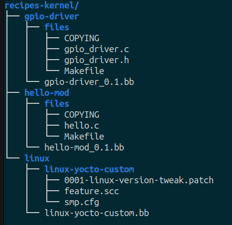

# GPIO Driver for Raspberry Pi _(Using Yocto)_

## Objective

The objective to create a simple GPIO driver for Raspberry Pi using Yocto. The driver will be able to control the GPIO pins of the Raspberry Pi, when inserted into the kernel. Corresponding devices _(representing GPIO pins)_ will be created in the `/dev` directory.

---

## Approach

1. Create a simple GPIO driver module that uses the `gpio.h` header file.
2. Depending on the GPIO pins needed, add their corresponding entries _(for devices)_ in the device tree.
3. Build the kernel with the GPIO driver module to check if everything is working ... :exclamation: **Don't try to insmod ... as the GPIO pins is not supported on your host-machine (lap/desktop)**

> :grey_exclamation: You might need to modify the code to fit your needs (pins needed & their direction).

### For yocto

1. Create a **new layer** _(if not already created)_ taking `meta-skeleton` as a reference.
2. Use the `recieps-kernel` to add the GPIO driver module recipe. **You will need linux recipe !!!**
3. Add your recipe for the GPIO driver module.
4. Modify the recipe with the necessary changes. _(like adding the source files, etc.)_
5. Modify the **Makefile** to fit your source files.
6. **Bitbake** your kernel recipe module to check if everything is working. **You might get compiler errors due to kernel version mismatch. ... _just try to fix them._** `bitbake <your-kernel-module-recipe-name>`
7. If it builds successfully, then you can try to **bitbake** your image to check if the GPIO driver module is included in the kernel. `bitbake <your-image-recipe-name>`
8. Flash the image to your Raspberry Pi and check if the GPIO driver module is working. Your module would be under `/lib/modules/<kernel-version>/extra/` directory.

### Recipe Structure

Your recipe structure should be something like this:

